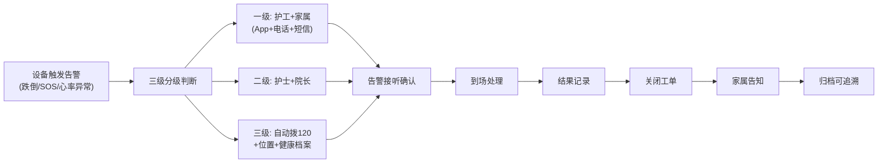
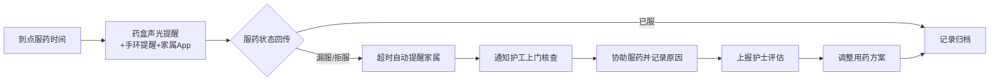
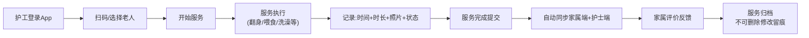

## 1. 产品概述
本平台为居家+机构一体化智慧养老照护平台，覆盖老人建档、智能监测、健康管理、照护服务、用药管理、紧急救援、费用结算、家属互动、院长监管全场景。以安全、健康、服务、合规、透明为核心，实现数据自动采集、AI智能预警、服务闭环可追溯、家属实时知情、机构高效管理。

## 2. 核心功能

### 2.1 用户角色

| 角色 | 注册方式 | 核心权限 |
|------|----------|----------|
| 护工 | 管理员创建 | 服务记录、上门照护、告警处理、服药提醒、上传照片 |
| 护士 | 管理员创建 | 健康评估、用药管理、异常审核、护工监督、健康方案 |
| 家属 | 手机号注册 | 查看健康、查看服务、接收预警、探视预约、在线缴费、反馈评价 |
| 院长 | 系统初始化 | 全机构数据、人员管理、服务监管、财务账单、大屏统计、报表导出 |

### 2.2 功能模块
1. **登录与权限中心**：角色登录、RBAC权限控制、操作留痕
2. **老人档案管理**：基本信息、健康数据、用药计划、紧急联系人、智能设备绑定
3. **健康监测中心**：实时数据采集、趋势曲线、健康报告、异常预警
4. **智能预警系统**：三级紧急预警、跌倒/SOS告警、漏服提醒、事件闭环处置
5. **照护服务管理**：服务记录、工单派单、服务评价、质量追溯
6. **用药管理系统**：用药计划、智能提醒、服药统计、漏服干预
7. **家属互动平台**：健康查看、服务记录、探视预约、费用缴纳、评价反馈
8. **费用结算中心**：自动计费、月度账单、在线缴费、补贴核算、财务对账
9. **管理数据大屏**：实时监控、统计分析、多维度筛选、数据可视化
10. **系统管理**：人员管理、设备管理、权限配置、日志审计

### 2.3 页面详情

| 页面名称 | 模块名称 | 功能描述 |
|----------|----------|----------|
| 登录页 | 身份认证 | 账号密码登录、角色选择、忘记密码 |
| 院长首页 | 管理大屏 | 老人总数、护理等级分布、健康异常数、预警处置率、服务完成率、用药依从率、设备在线率 |
| 老人列表 | 档案管理 | 老人列表展示、筛选搜索、新增编辑、详情查看 |
| 老人详情 | 档案详情 | 基本信息、健康档案、用药计划、紧急联系人、设备绑定、服务记录 |
| 健康监测 | 实时监测 | 心率血压血氧体温实时数据、趋势曲线、睡眠分析、活动量统计 |
| 预警中心 | 告警管理 | 告警列表、分级展示、处置流程、工单跟踪、闭环记录 |
| 照护服务 | 服务工单 | 服务列表、派单处理、服务记录、照片上传、服务评价 |
| 用药管理 | 服药中心 | 用药计划配置、服药提醒、服药记录、漏服统计、依从率分析 |
| 探视预约 | 家属服务 | 预约申请、审核处理、探视记录、限流管理 |
| 费用管理 | 财务中心 | 账单列表、自动计费、在线缴费、欠费提醒、补贴核算 |
| 家属端首页 | 家属门户 | 老人健康概览、最新服务记录、预警通知、快捷操作 |
| 系统设置 | 权限管理 | 用户管理、角色配置、设备管理、操作日志、数据备份 |

## 3. 核心流程

### 3.1 紧急预警闭环流程

### 3.2 漏服药闭环流程

### 3.3 照护服务流程

## 4. 用户界面设计

### 4.1 设计风格
- **主色调**：温暖的医疗蓝 (#1E88E5) 作为主色，传递专业与信任感；辅助色为暖橙色 (#FF9800) 体现关怀与温度；生命绿 (#4CAF50) 表示健康；警示红 (#F44336) 用于紧急预警
- **按钮风格**：圆角8px，微立体阴影，hover时有轻微上浮效果，紧急按钮使用呼吸动画
- **字体方案**：标题使用"Noto Serif SC"体现稳重专业，正文使用"Noto Sans SC"保证可读性
- **布局风格**：卡片式布局，清晰的信息层级，充足的留白，医疗级的整洁感
- **图标风格**：线性图标搭配柔和圆角，状态指示使用明显的颜色区分

### 4.2 页面设计概览

| 页面名称 | 模块名称 | UI元素 |
|----------|----------|--------|
| 登录页 | 身份认证 | 渐变背景、卡片式登录框、角色选择切换、动效登录按钮 |
| 管理大屏 | 院长首页 | 数据看板网格布局、实时数据滚动、告警闪烁动效、图表可视化、状态指示徽章 |
| 健康监测 | 实时监测 | 大数字展示实时数据、平滑曲线趋势图、异常区域高亮、设备在线状态 |
| 预警中心 | 告警管理 | 分级颜色标签、告警声音提示、处置进度条、工单时间线 |
| 老人详情 | 档案管理 | Tab页签切换、信息分组卡片、头像+状态徽章、时间轴记录 |
| 家属端首页 | 家属门户 | 亲人健康卡片、今日数据概览、快捷操作区、最新消息通知 |

### 4.3 响应式设计
- **桌面优先**：管理端采用1920px宽度设计，适配主流办公显示器
- **平板适配**：1024px断点，侧边栏可折叠，表格支持横向滚动
- **移动端**：护工App端375px设计，底部导航栏，大按钮便于操作，支持拍照上传
- **家属端H5**：375px-768px自适应，卡片堆叠布局，下拉刷新，上滑加载

### 4.4 交互与动效
- **告警动效**：红色预警卡片使用脉冲动画，SOS告警全屏闪烁提示
- **数据更新**：实时数据变化时数字滚动过渡，图表平滑重绘
- **页面切换**：淡入淡出过渡，内容区域从下往上滑入
- **微交互**：按钮点击缩放反馈，表单输入错误抖动提示，加载状态骨架屏
