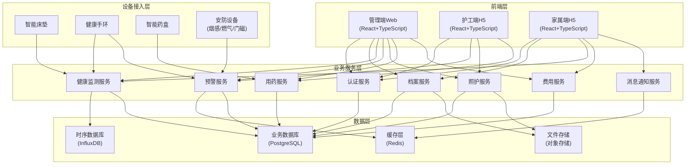
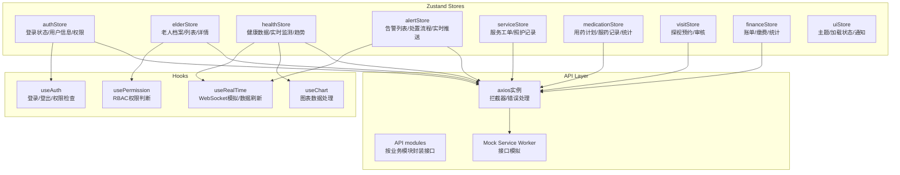
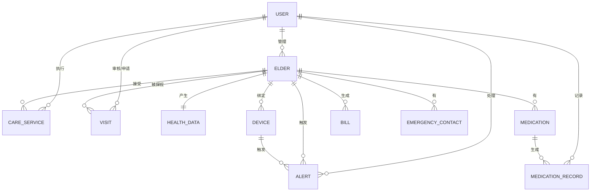

## 1. 架构设计



## 2. 技术描述

- **前端框架**：React@18.2 + TypeScript@5.3 + Vite@5.0
- **状态管理**：Zustand@4.5（轻量高效，支持多模块状态隔离）
- **UI组件库**：Ant Design@5.15（管理端）+ 自研移动端组件（H5端）
- **样式方案**：TailwindCSS@3.4 + CSS Variables（主题切换）
- **图表库**：ECharts@5.5（数据可视化）+ Recharts@2.12（健康曲线）
- **路由管理**：React Router@6.22（支持路由守卫、权限控制）
- **HTTP客户端**：Axios@1.6（请求拦截、响应拦截、自动重试）
- **日期处理**：dayjs@1.11
- **图标库**：@ant-design/icons + Lucide React
- **Mock数据**：MSW@2.2（接口模拟，便于前端独立开发）
- **后端模拟**：使用Mock + LocalStorage实现完整业务逻辑，无需真实后端

## 3. 路由定义

| 路由路径 | 权限角色 | 页面用途 |
|----------|----------|----------|
| `/login` | 所有 | 登录页面，角色选择 |
| `/director/dashboard` | 院长 | 管理大屏首页 |
| `/director/elders` | 院长 | 老人列表管理 |
| `/director/elders/:id` | 院长 | 老人详情档案 |
| `/director/health` | 院长,护士 | 健康监测中心 |
| `/director/alerts` | 院长,护士,护工 | 预警中心 |
| `/director/services` | 院长,护士,护工 | 照护服务工单 |
| `/director/medication` | 院长,护士 | 用药管理 |
| `/director/visits` | 院长,护士,家属 | 探视预约管理 |
| `/director/finance` | 院长 | 费用结算管理 |
| `/director/staff` | 院长 | 人员管理 |
| `/director/settings` | 院长 | 系统设置 |
| `/family/home` | 家属 | 家属端首页 |
| `/family/health` | 家属 | 健康数据查看 |
| `/family/services` | 家属 | 服务记录查看 |
| `/family/visits` | 家属 | 探视预约申请 |
| `/family/bills` | 家属 | 费用账单缴纳 |
| `/caregiver/tasks` | 护工 | 照护任务列表 |
| `/caregiver/tasks/:id` | 护工 | 服务执行记录 |
| `/caregiver/alerts` | 护工 | 待处理告警 |
| `/caregiver/medication` | 护工 | 服药提醒核查 |

## 4. API 类型定义

```typescript
// 用户相关
interface User {
  id: string;
  username: string;
  name: string;
  role: 'director' | 'nurse' | 'caregiver' | 'family';
  phone: string;
  avatar?: string;
  status: 'active' | 'inactive';
  createdAt: string;
}

// 老人档案
interface Elder {
  id: string;
  name: string;
  gender: 'male' | 'female';
  age: number;
  avatar?: string;
  idCard: string;
  address: string;
  careType: 'home' | 'institution';
  careLevel: 'level1' | 'level2' | 'level3' | 'special';
  roomNumber?: string;
  bedNumber?: string;
  medicalInsurance: string;
  economicStatus: string;
  assessmentReport: string;
  // 健康数据
  medicalHistory: string[];
  allergies: string[];
  chronicDiseases: string[];
  bloodPressureBaseline: { systolic: number; diastolic: number };
  bloodSugarBaseline: number;
  dietaryRestrictions: string[];
  mobility: 'normal' | 'assisted' | 'wheelchair' | 'bedridden';
  cognitiveStatus: 'normal' | 'mild' | 'moderate' | 'severe';
  sleepHabits: string;
  // 紧急联系人
  emergencyContacts: EmergencyContact[];
  // 设备绑定
  devices: Device[];
  // 用药计划
  medications: Medication[];
  status: 'active' | 'discharged' | 'deceased';
  createdAt: string;
}

interface EmergencyContact {
  id: string;
  name: string;
  relationship: string;
  phone: string;
  priority: number;
  type: 'family' | 'community' | 'hospital';
}

interface Device {
  id: string;
  type: 'mattress' | 'bracelet' | 'pillbox' | 'smoke' | 'gas' | 'door';
  name: string;
  serialNumber: string;
  status: 'online' | 'offline' | 'error';
  lastOnline: string;
}

interface Medication {
  id: string;
  name: string;
  dosage: string;
  usage: string;
  times: string[];
  frequency: string;
  contraindications: string;
  prescriptionSource: string;
  validUntil: string;
  reminders: boolean;
}

// 健康数据
interface HealthData {
  id: string;
  elderId: string;
  timestamp: string;
  heartRate: number;
  bloodPressure: { systolic: number; diastolic: number };
  bloodOxygen: number;
  temperature: number;
  sleepStatus: 'awake' | 'light' | 'deep';
  inBed: boolean;
  activityLevel: number;
}

// 预警告警
interface Alert {
  id: string;
  elderId: string;
  type: 'fall' | 'inactivity' | 'out_of_bed' | 'heart_rate' | 'respiration' | 'sos' | 'medication_miss' | 'door' | 'smoke' | 'gas';
  level: 1 | 2 | 3;
  status: 'pending' | 'acknowledged' | 'processing' | 'resolved' | 'closed';
  triggeredAt: string;
  acknowledgedAt?: string;
  resolvedAt?: string;
  location?: string;
  description: string;
  assignedTo?: string;
  handlingNotes: AlertNote[];
}

interface AlertNote {
  id: string;
  userId: string;
  userName: string;
  timestamp: string;
  action: string;
  note: string;
  photos?: string[];
}

// 照护服务
interface CareService {
  id: string;
  elderId: string;
  elderName: string;
  type: string;
  scheduledAt: string;
  startedAt?: string;
  completedAt?: string;
  caregiverId: string;
  caregiverName: string;
  duration?: number;
  status: 'scheduled' | 'in_progress' | 'completed' | 'missed' | 'cancelled';
  notes?: string;
  photos?: string[];
  elderStatus?: string;
  rating?: number;
  feedback?: string;
}

// 用药记录
interface MedicationRecord {
  id: string;
  elderId: string;
  medicationId: string;
  medicationName: string;
  scheduledTime: string;
  takenAt?: string;
  status: 'scheduled' | 'taken' | 'missed' | 'refused';
  notedBy?: string;
  note?: string;
}

// 探视预约
interface Visit {
  id: string;
  elderId: string;
  applicantName: string;
  applicantPhone: string;
  relationship: string;
  visitorCount: number;
  scheduledAt: string;
  purpose: string;
  status: 'pending' | 'approved' | 'rescheduled' | 'rejected' | 'completed';
  approvedBy?: string;
  approvedAt?: string;
  rejectReason?: string;
  actualArrival?: string;
  actualDeparture?: string;
}

// 费用账单
interface Bill {
  id: string;
  elderId: string;
  month: string;
  items: BillItem[];
  totalAmount: number;
  subsidyAmount: number;
  payableAmount: number;
  paidAmount: number;
  status: 'unpaid' | 'partial' | 'paid' | 'overdue';
  dueDate: string;
  paidAt?: string;
  paymentMethod?: string;
}

interface BillItem {
  id: string;
  name: string;
  type: 'care' | 'service' | 'device' | 'material' | 'other';
  quantity: number;
  unitPrice: number;
  amount: number;
  description: string;
}
```

## 5. 前端状态管理架构



## 6. 数据模型（Mock数据结构）

### 6.1 核心数据实体关系



### 6.2 初始Mock数据

```typescript
// 测试账号
const mockUsers = [
  { id: '1', username: 'director', password: '123456', name: '张院长', role: 'director', phone: '13800138000' },
  { id: '2', username: 'nurse', password: '123456', name: '李护士', role: 'nurse', phone: '13800138001' },
  { id: '3', username: 'caregiver', password: '123456', name: '王护工', role: 'caregiver', phone: '13800138002' },
  { id: '4', username: 'family', password: '123456', name: '刘家属', role: 'family', phone: '13800138003' },
];

// 示例老人数据
const mockElders = [
  {
    id: 'elder1',
    name: '陈桂英',
    gender: 'female',
    age: 78,
    careType: 'institution',
    careLevel: 'level2',
    roomNumber: '302',
    bedNumber: 'A',
    chronicDiseases: ['高血压', '糖尿病'],
    bloodPressureBaseline: { systolic: 140, diastolic: 90 },
    bloodSugarBaseline: 7.8,
    mobility: 'assisted',
    cognitiveStatus: 'normal',
    status: 'active',
  },
  {
    id: 'elder2',
    name: '王德明',
    gender: 'male',
    age: 82,
    careType: 'institution',
    careLevel: 'level3',
    roomNumber: '201',
    bedNumber: 'B',
    chronicDiseases: ['冠心病', '关节炎'],
    mobility: 'wheelchair',
    cognitiveStatus: 'mild',
    status: 'active',
  },
];
```

## 7. 目录结构

```
src/
├── assets/              # 静态资源
├── components/          # 公共组件
│   ├── layout/         # 布局组件
│   ├── charts/         # 图表组件
│   ├── cards/          # 卡片组件
│   ├── forms/          # 表单组件
│   └── ui/             # 基础UI组件
├── pages/              # 页面组件
│   ├── login/
│   ├── director/
│   │   ├── dashboard/
│   │   ├── elders/
│   │   ├── health/
│   │   ├── alerts/
│   │   ├── services/
│   │   ├── medication/
│   │   ├── visits/
│   │   ├── finance/
│   │   ├── staff/
│   │   └── settings/
│   ├── family/
│   │   ├── home/
│   │   ├── health/
│   │   ├── services/
│   │   ├── visits/
│   │   └── bills/
│   └── caregiver/
│       ├── tasks/
│       ├── alerts/
│       └── medication/
├── stores/             # Zustand状态管理
├── hooks/              # 自定义Hooks
├── api/                # API接口
├── types/              # TypeScript类型定义
├── utils/              # 工具函数
├── mock/               # Mock数据
├── styles/             # 全局样式
├── router/             # 路由配置
└── App.tsx
```
